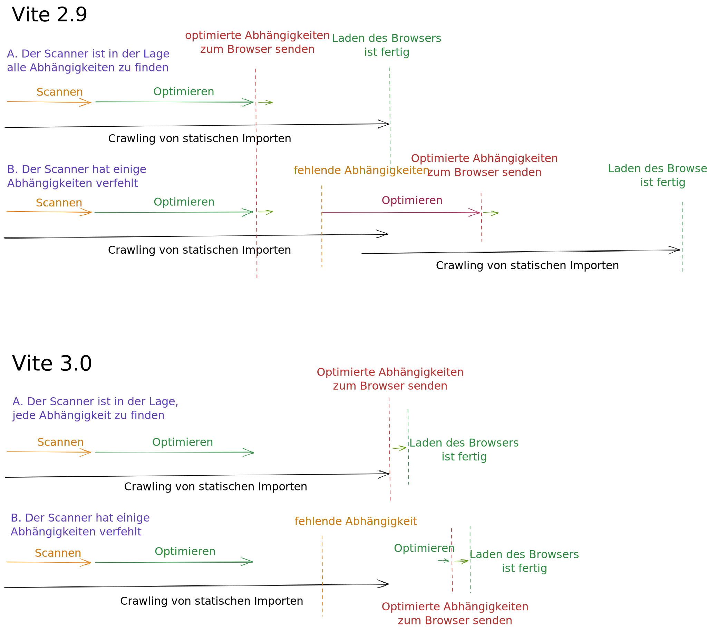

# Vite 3.0 ist da!

_23. Juli 2022_ - Schauen Sie sich die [Ankündigung von Vite 4.0](./announcing-vite4.md) an.

Im Februar letzten Jahres veröffentlichte [Evan You](https://twitter.com/youyuxi) Vite 2. Seitdem hat seine Verbreitung stetig zugenommen und erreicht mehr als 1 Million npm-Downloads pro Woche. Nach der Veröffentlichung bildete sich schnell ein weitläufiges Ökosystem. Vite treibt ein erneuertes Rennen um Innovationen in Web-Frameworks an. [Nuxt 3](https://v3.nuxtjs.org/) verwendet standardmäßig Vite. [SvelteKit](https://kit.svelte.dev/), [Astro](https://astro.build/), [Hydrogen](https://hydrogen.shopify.dev/) und [SolidStart](https://docs.solidjs.com/start) wurden alle mit Vite erstellt. [Laravel hat sich nun entschieden, standardmäßig Vite zu verwenden](https://laravel.com/docs/9.x/vite). [Vite Ruby](https://vite-ruby.netlify.app/) zeigt, wie Vite die Entwicklererfahrung von Rails verbessern kann. [Vitest](https://vitest.dev) macht als Vite-native Alternative zu Jest Fortschritte. Vite steht hinter den neuen Komponententestfunktionen von [Cypress](https://docs.cypress.io/guides/component-testing/writing-your-first-component-test) und [Playwright](https://playwright.dev/docs/test-components), Storybook hat [Vite als offiziellen Builder](https://github.com/storybookjs/builder-vite). Und [die Liste geht weiter](https://patak.dev/vite/ecosystem.html). Die Betreuer dieser Projekte waren an der Verbesserung des Vite-Kerns beteiligt und arbeiteten eng mit dem Vite [Team](https://vitejs.dev/team) und anderen Beitragenden zusammen.


Heute, 16 Monate nach dem Start von V2, freuen wir uns, die Veröffentlichung von Vite 3 anzukündigen. Wir haben uns entschieden, mindestens einmal im Jahr eine neue Vite-Version zu veröffentlichen, um sie mit dem [Ende des Lebenszyklus von Node.js](https://nodejs.org/en/about/releases/) abzustimmen, und die Gelegenheit zu nutzen, Vites API regelmäßig mit einem kurzen Migrationspfad für Projekte im Ökosystem zu überprüfen.

Schnellzugriffe:

- [Dokumentation](/)
- [Migrationsleitfaden](https://v3.vitejs.dev/guide/migration.html)
- [Änderungsprotokoll](https://github.com/vitejs/vite/blob/main/packages/vite/CHANGELOG.md#300-2022-07-13)

Wenn Sie neu bei Vite sind, empfehlen wir Ihnen, den [Leitfaden "Warum Vite"](https://vitejs.dev/guide/why.html) zu lesen. Werfen Sie dann einen Blick auf den [Einstieg](https://vitejs.dev/guide/) und den [Funktionsleitfaden](https://vitejs.dev/guide/features), um zu sehen, was Vite von Anfang an bietet. Beiträge sind wie immer auf [GitHub](https://github.com/vitejs/vite) willkommen. Bisher haben mehr als [600 Mitwirkende](https://github.com/vitejs/vite/graphs/contributors) dazu beigetragen, Vite zu verbessern. Folgen Sie den Updates auf [Twitter](https://twitter.com/vite_js) oder nehmen Sie an Diskussionen mit anderen Vite-Nutzern auf unserem [Discord-Chat-Server](http://chat.vitejs.dev/) teil.

## Neue Dokumentation

Gehen Sie zu [vitejs.dev](https://vitejs.dev), um die neuen V3-Dokumente zu genießen. Vite verwendet jetzt das neue Standardthema von [VitePress](https://vitepress.vuejs.org) mit einem atemberaubenden Dark Mode und anderen Funktionen.

[](https://vitejs.dev)

Mehrere Projekte im Ökosystem sind bereits auf sie umgestiegen (siehe [Vitest](https://vitest.dev), [vite-plugin-pwa](https://vite-plugin-pwa.netlify.app/) und [VitePress](https://vitepress.vuejs.org/) selbst).

Wenn Sie auf die Vite-2-Dokumentation zugreifen müssen, bleibt sie unter [v2.vitejs.dev](https://v2.vitejs.dev) online verfügbar. Es gibt auch eine neue Unterdomäne [main.vitejs.dev](https://main.vitejs.dev), auf der jeder Commit im Hauptzweig von Vite automatisch bereitgestellt wird. Dies ist nützlich, wenn Sie Beta-Versionen testen oder zur Entwicklung des Kerns beitragen.

Es gibt jetzt auch eine offizielle spanische Übersetzung, die zu den bisherigen chinesischen und japanischen Übersetzungen hinzugefügt wurde:

- [简体中文](https://cn.vitejs.dev/)
- [日本語](https://ja.vitejs.dev/)
- [Español](https://es.vitejs.dev/)

## Erstellung von Vite Startervorlagen

Die [create-vite](/guide/#trying-vite-online)-Vorlagen sind ein großartiges Werkzeug, um Vite schnell mit Ihrem Lieblingsframework zu testen. In Vite 3 haben alle Vorlagen ein neues Thema im Einklang mit den neuen Dokumenten erhalten. Öffnen Sie sie online und beginnen Sie jetzt mit Vite 3 zu experimentieren:

<div class="stackblitz-links">
<a target="_blank" href="https://vite.new"></a>
<a target="_blank" href="https://vite.new/vue"></a>
<a target="_blank" href="https://vite.new/svelte"></a>
<a target="_blank" href="https://vite.new/react"></a>
<a target="_blank" href="https://vite.new/preact"></a>
<a target="_blank" href="https://vite.new/lit"></a>
</div>

<style>
.stackblitz-links {
  display: flex;
  width: 100%;
  justify-content: space-around;
  align-items: center;
}
@media screen and (max-width: 550px) {
  .stackblitz-links {
    display: grid;
    grid-template-columns: 1fr 1fr 1fr;
    width: 100%;
    gap: 2rem;
    padding-left: 3rem;
    padding-right: 3rem;
  }
}
.stackblitz-links > a {
  width: 70px;
  height: 70px;
  display: grid;
  align-items: center;
  justify-items: center;
}
.stackblitz-links > a:hover {
  filter: drop-shadow(0 0 0.5em #646cffaa);
}
</style>

Das Thema wird nun von allen Vorlagen gemeinsam genutzt. Dies sollte helfen, den Umfang dieser Startervorlagen als minimale Vorlagen für den Einstieg mit Vite besser zu vermitteln. Für umfassendere Lösungen, einschließlich Linting, Testeinrichtung und anderen Funktionen, gibt es offizielle Vite-basierte Vorlagen für einige Frameworks wie [create-vue](https://github.com/vuejs/create-vue) und [create-svelte](https://github.com/sveltejs/kit). Es gibt eine von der Community gepflegte Liste von Vorlagen unter [Awesome Vite](https://github.com/vitejs/awesome-vite#templates).

## Entwicklungsverbesserungen

### Vite CLI

<pre style="background-color: var(--vp-code-block-bg);padding:2em;border-radius:8px;max-width:100%;overflow-x:auto;">
  <span style="color:lightgreen"><b>VITE</b></span> <span style="color:lightgreen">v3.0.0</span>  <span style="color:gray">ready in <b>320</b> ms</span>

  <span style="color:lightgreen"><b>➜</b></span>  <span style="color:white"><b>Local</b>:</span>   <span style="color:cyan">http://127.0.0.1:5173/</span>
  <span style="color:green"><b>➜</b></span>  <span style="color:gray"><b>Network</b>: use --host to expose</span>
</pre>

Neben den ästhetischen Verbesserungen der CLI werden Sie feststellen, dass der Standardentwicklungsserverport jetzt 5173 und der Vorschau-Serverport 4173 ist. Diese Änderung stellt sicher, dass Vite keine Konflikte mit anderen Tools verursacht.

### Verbesserte WebSocket-Verbindungstrategie

Ein Schmerzpunkt von Vite 2 war die Konfiguration des Servers beim Betrieb hinter einem Proxy. Vite 3 ändert das Standardverbindungsschema, sodass es in den meisten Szenarien von Anfang an funktioniert. Alle diese Setups werden nun als Teil des Vite-Ecosystem-CI durch [`vite-setup-catalogue`](https://github.com/sapphi-red/vite-setup-catalogue) getestet.

### Verbesserungen bei Kaltstarts

Vite vermeidet jetzt während eines Kaltstarts einen vollständigen Neustart, wenn Imports durch Plugins injiziert werden, während die anfänglich statisch importierten Module durchsucht werden ([#8869](https://github.com/vitejs/vite/issues/8869)).

<details>
  <summary><b>Hier klicken, um mehr zu erfahren</b></summary>

In Vite 2.9 wurden sowohl der Scanner als auch der Optimierer im Hintergrund ausgeführt. Im besten Fall, in dem der Scanner jede Abhängigkeit gefunden hätte, war kein Neustart während eines Kaltstarts erforderlich. Aber wenn der Scanner eine Abhängigkeit verpasste, war eine neue Optimierungsphase und dann ein Neustart erforderlich. Vite konnte einige dieser Neustarts in v2.9 vermeiden, indem er erkannte, ob die neuen optimierten Chunks mit denjenigen kompatibel waren, die der Browser hatte. Aber wenn es eine gemeinsame Abhängigkeit gab, konnten sich die Unterchunks ändern, und ein Neustart war erforderlich, um doppelte Zustände zu vermeiden. In Vite 3 werden die optimierten Abhängigkeiten dem Browser erst übergeben, wenn das Durchsuchen der statischen Imports abgeschlossen ist. Eine schnelle Optimierungsphase wird ausgelöst, wenn eine Abhängigkeit fehlt (z. B. durch ein Plugin injiziert), und erst dann werden die gebündelten Abhängigkeiten gesendet. Ein Seitenneustart ist also nicht mehr erforderlich.

</details>



### import.meta.glob

Die Unterstützung für `import.meta.glob` wurde neu geschrieben. Lesen Sie mehr über die neuen Funktionen in der [Glob Import Guide](/guide/features.html#glob-import):

[Mehrere Muster](/guide/features.html#multiple-patterns) können als Array übergeben werden

```js
import.meta.glob(['./dir/*.js', './another/*.js'])
```

[Negative Muster](/guide/features.html#negative-patterns) werden jetzt unterstützt (mit `!`), um bestimmte Dateien zu ignorieren

```js
import.meta.glob(['./dir/*.js', '!**/bar.js'])
```

[Benannte Imports](/guide/features.html#named-imports) können angegeben werden, um das Tree-Shaking zu verbessern

```js
import.meta.glob('./dir/*.js', { import: 'setup' })
```

[Benutzerdefinierte Abfragen](/guide/features.html#custom-queries) können übergeben werden, um Metadaten anzuhängen

```js
import.meta.glob('./dir/*.js', { query: { custom: 'data' } })
```

[Eager Imports](/guide/features.html#glob-import) wird jetzt als Flag übergeben

```js
import.meta.glob('./dir/*.js', { eager: true })
```

### Abstimmung der WASM-Importe auf zukünftige Standards

Die WebAssembly-Import-API wurde überarbeitet, um Kollisionen mit zukünftigen Standards zu vermeiden und flexibler zu gestalten:

```js
import init from './example.wasm?init'

init().then((instance) => {
  instance.exports.test()
})
```

Erfahren Sie mehr im [WebAssembly-Guide](/guide/features.html#webassembly)

## Verbesserungen beim Erstellen

### ESM-SSR-Build standardmäßig

Die meisten SSR-Frameworks im Ökosystem verwendeten bereits ESM-Builds. Daher macht Vite 3 ESM zum Standardformat für SSR-Builds. Dies ermöglicht es uns, die bisherige [SSR-Externalisierungsheuristik](https://vitejs.dev/guide/ssr.html#ssr-externals) zu optimieren, indem Abhängigkeiten standardmäßig externalisiert werden.

### Verbesserte Unterstützung für relative Basis

Vite 3 unterstützt jetzt eine relative Basis (mit `base: ''`) ordnungsgemäß, sodass erstellte Ressourcen ohne erneutes Erstellen an verschiedene Basen bereitgestellt werden können. Dies ist nützlich, wenn die Basis zur Build-Zeit nicht bekannt ist, beispielsweise beim Bereitstellen auf inhaltsadressierbaren Netzwerken wie [IPFS](https://ipfs.io/).

## Experimentelle Funktionen

### Feinere Steuerung der Build-Asset-Pfade (experimentell)

Es gibt andere Bereitstellungsszenarien, in denen dies nicht ausreicht. Wenn beispielsweise die generierten gehashten Assets auf einen anderen CDN als die öffentlichen Dateien bereitgestellt werden müssen, ist eine feinere Steuerung der Pfadgenerierung zur Build-Zeit erforderlich. Vite 3 bietet eine experimentelle API zur Modifizierung der erstellten Dateipfade. Weitere Informationen finden Sie unter [Erweiterte Basiseinstellungen erstellen](/guide/build.html#advanced-base-options).

### Esbuild-Abhängigkeitsoptimierung zur Build-Zeit (experimentell)

Einer der Hauptunterschiede zwischen Entwicklungs- und Build-Zeit besteht darin, wie Vite Abhängigkeiten behandelt. Während der Build-Zeit wird [`@rollup/plugin-commonjs`](https://github.com/rollup/plugins/tree/master/packages/commonjs) verwendet, um das Importieren von CJS-Only-Abhängigkeiten (wie React) zu ermöglichen. Bei Verwendung des Entwicklungsservers wird stattdessen Esbuild verwendet, um Abhängigkeiten vorzubündeln und zu optimieren, und es wird ein Inline-Interop-Schema angewendet, während der Benutzercode, der CJS-Abhängigkeiten importiert, transformiert wird. Während der Entwicklung von Vite 3 haben wir die Änderungen eingeführt, die erforderlich sind, um auch die Verwendung der [Esbuild-Abhängigkeitsoptimierung zur Build-Zeit](https://v3.vitejs.dev/guide/migration.html#using-esbuild-deps-optimization-at-build-time) zu ermöglichen. [`@rollup/plugin-commonjs`](https://github.com/rollup/plugins/tree/master/packages/commonjs) kann dann vermieden werden, um Entwicklungs- und Build-Zeit auf die gleiche Weise arbeiten zu lassen.

Da Rollup v3 in den nächsten Monaten veröffentlicht wird und wir einen weiteren Vite-Major veröffentlichen werden, haben wir beschlossen, diesen Modus optional zu machen, um den Vite 3-Bereich zu reduzieren und Vite und dem Ökosystem mehr Zeit zu geben, mögliche Probleme mit dem neuen CJS-Interop-Ansatz zur Build-Zeit zu beheben. Frameworks können zur Verwendung der Esbuild-Abhängigkeitsoptimierung zur Build-Zeit standardmäßig in ihrem eigenen Tempo wechseln, bevor Vite 4 erscheint.

### HMR Partial Accept (experimentell)

Es gibt die Möglichkeit zur Aktivierung der [teilweisen HMR-Akzeptanz (HMR Partial Accept)](https://github.com/vitejs/vite/pull/7324). Diese Funktion könnte eine feinere HMR für Framework-Komponenten ermöglichen, die mehrere Bindungen im selben Modul exportieren. Weitere Informationen finden Sie in [der Diskussion zu diesem Vorschlag](https://github.com/vitejs/vite/discussions/7309).

## Reduzierung der Bundle-Größe

Vite legt Wert auf den Veröffentlichungs- und Installations-Fußabdruck; eine schnelle Installation einer neuen Anwendung ist ein Merkmal. Vite bündelt die meisten seiner Abhängigkeiten und versucht, moderne, leichtgewichtige Alternativen zu verwenden, wo immer möglich. Im Rahmen dieses fortlaufenden Ziels ist die Veröffentlichungsgröße von Vite 3 um 30 % kleiner als die von Vite 2.

|             | Publish Size | Install Size |
| ----------- | :----------: | :----------: |
| Vite 2.9.14 |    4.38MB    |    19.1MB    |
| Vite 3.0.0  |    3.05MB    |    17.8MB    |
| Reduction   |     -30%     |     -7%      |

Ein Teil dieser Reduzierung wurde durch die Möglichkeit erreicht, einige Abhängigkeiten, die die meisten Benutzer nicht benötigten, optional zu machen. Erstens wird [Terser](https://github.com/terser/terser) nicht mehr standardmäßig installiert. Diese Abhängigkeit war nicht mehr erforderlich, da wir bereits in Vite 2 esbuild als den Standard-Minifizierer für JS und CSS verwendet haben. Wenn Sie `build.minify: 'terser'` verwenden, müssen Sie es jetzt manuell installieren (`npm add -D terser`). Außerdem haben wir [node-forge](https://github.com/digitalbazaar/forge) aus dem Monorepo entfernt und Unterstützung für die automatische Generierung von HTTPS-Zertifikaten als neues Plugin hinzugefügt: [`@vitejs/plugin-basic-ssl`](https://v3.vitejs.dev/guide/migration.html#automatic-https-certificate-generation). Da diese Funktion nur nicht vertrauenswürdige Zertifikate erstellt, die nicht im lokalen Speicher abgelegt werden, rechtfertigte sie nicht die zusätzliche Größe.

## Fehlerbehebung

Eine Triagierungsmarathon wurde von [@bluwyoo](https://twitter.com/bluwyoo), [@sapphi_red](https://twitter.com/sapphi_red) angeführt, die kürzlich dem Vite-Team beigetreten sind. In den letzten drei Monaten wurden die offenen Vite-Probleme von 770 auf 400 reduziert. Dieser Tauchgang wurde erreicht, während die neu eröffneten Pull-Anfragen auf einem Allzeithoch waren. Gleichzeitig hat [@haoqunjiang](https://twitter.com/haoqunjiang) eine umfassende [Übersicht über Vite-Probleme](https://github.com/vitejs/vite/discussions/8232) kuratiert.

[](https://www.repotrends.com/vitejs/vite)

[](https://www.repotrends.com/vitejs/vite)

## Kompatibilitätsnotizen

- Vite unterstützt nicht mehr Node.js 12 / 13 / 15, da sie das Ende ihres Lebenszyklus erreicht haben. Node.js 14.18+ / 16+ wird jetzt benötigt.
- Vite wird jetzt als ESM (ECMAScript-Modul) veröffentlicht, mit einem CJS-Proxy zum ESM-Eintrag für die Kompatibilität.
- Die Baseline für moderne Browser zielt jetzt auf Browser ab, die die [native ES-Module](https://caniuse.com/es6-module), [nativen ESM-Dynamic Import](https://caniuse.com/es6-module-dynamic-import) und [`import.meta`](https://caniuse.com/mdn-javascript_operators_import_meta)-Funktionen unterstützen.
- Die Dateierweiterungen für JS in SSR (Server-Side Rendering) und Bibliotheksmodus verwenden jetzt eine gültige Erweiterung (`js`, `mjs` oder `cjs`) für Ausgabe-JS-Einträge und -Chunks basierend auf ihrem Format und dem Pakettyp.

Erfahren Sie mehr im [Migrationsleitfaden](https://v3.vitejs.dev/guide/migration.html).

## Upgrades für Vite Core

Während der Arbeit an Vite 3 haben wir auch die Mitarbeits-Erfahrung für Mitarbeiter am [Vite Core](https://github.com/vitejs/vite) verbessert.

- Unit- und E2E-Tests wurden zu [Vitest](https://vitest.dev) migriert, was eine schnellere und stabilere DX (Entwicklererfahrung) bietet. Dieser Schritt diente auch als Eigenanwendung für ein wichtiges Infrastrukturprojekt in der Vite-Ökosystem.
- Der VitePress-Build wird jetzt im Rahmen der CI getestet.
- Vite wurde auf [pnpm 7](https://pnpm.io/) aktualisiert, um dem Rest des Ökosystems zu folgen.
- Die Playgrounds wurden aus dem Verzeichnis "packages" in [`/playgrounds`](https://github.com/vitejs/vite/tree/main/playground) verschoben.
- Die Pakete und Playgrounds haben jetzt `"type": "module"`.
- Plugins werden jetzt mit [unbuild](https://github.com/unjs/unbuild) gebündelt, und [plugin-vue-jsx](https://github.com/vitejs/vite-plugin-vue/tree/main/packages/plugin-vue-jsx) und [plugin-legacy](https://github.com/vitejs/vite/tree/main/packages/plugin-legacy) wurden auf TypeScript umgestellt.

## Das Ökosystem ist bereit für Vite 3

Wir haben eng mit Projekten im Ökosystem zusammengearbeitet, um sicherzustellen, dass Frameworks, die von Vite angetrieben werden, bereit für Vite 3 sind. [vite-ecosystem-ci](https://github.com/vitejs/vite-ecosystem-ci) ermöglicht es uns, die CI's der führenden Player im Ökosystem gegen den Hauptzweig von Vite auszuführen und zeitnahe Berichte zu erhalten, bevor eine Regression eingeführt wird. Die heutige Veröffentlichung sollte bald mit den meisten Projekten, die Vite verwenden, kompatibel sein.

## Danksagungen

Vite 3 ist das Ergebnis der gemeinsamen Anstrengungen der Mitglieder des [Vite Teams](/team), die zusammen mit den Ökosystem-Projektwartungsmitarbeitern und anderen Mitarbeitern am Vite-Kern gearbeitet haben.

Wir möchten allen danken, die Funktionen und Fehler implementiert, Feedback gegeben und an Vite 3 gearbeitet haben:

- Vite Team-Mitglieder [@youyuxi](https://twitter.com/youyuxi), [@patak_dev](https://twitter.com/patak_dev), [@antfu7](https://twitter.com/antfu7), [@bluwyoo](https://twitter.com/bluwyoo), [@sapphi_red](https://twitter.com/sapphi_red), [@haoqunjiang](https://twitter.com/haoqunjiang), [@poyoho](https://github.com/poyoho), [@Shini_92](https://twitter.com/Shini_92), und [@retropragma](https://twitter.com/retropragma).
- [@benmccann](https://github.com/benmccann), [@danielcroe](https://twitter.com/danielcroe), [@brillout](https://twitter.com/brillout), [@sheremet_va](https://twitter.com/sheremet_va), [@userquin](https://twitter.com/userquin), [@enzoinnocenzi](https://twitter.com/enzoinnocenzi), [@maximomussini](https://twitter.com/maximomussini), [@IanVanSchooten](https://twitter.com/IanVanSchooten), das [Astro team](https://astro.build/), und alle anderen Wartungsbetreuer von Frameworks und Plugins im Ökosystem, die dazu beigetragen haben, Vite 3 zu gestalten.
- [@dominikg](https://github.com/dominikg) für seine Arbeit am vite-ecosystem-ci.
- [@ZoltanKochan](https://twitter.com/ZoltanKochan) für seine Arbeit an [pnpm](https://pnpm.io/), und für seine schnelle Reaktionsfähigkeit, als wir Unterstützung benötigten.
- [@rixo](https://github.com/rixo) für den Support von HMR Partial Accept.
- [@KiaKing85](https://twitter.com/KiaKing85) für die Vorbereitung des Themes für die Vite 3-Veröffentlichung und [@\_brc_dd](https://twitter.com/_brc_dd) für die Arbeit an den internen VitePress-Teilen.
- [@CodingWithCego](https://twitter.com/CodingWithCego) für die neue spanische Übersetzung und [@ShenQingchuan](https://twitter.com/ShenQingchuan), [@hiro-lapis](https://github.com/hiro-lapis) und andere Mitglieder der Übersetzungsteams für Chinesisch und Japanisch, die die übersetzten Dokumente auf dem neuesten Stand gehalten haben.

Wir möchten auch Einzelpersonen und Unternehmen danken, die das Vite-Team sponsorn, sowie Unternehmen, die in die Entwicklung von Vite investieren: Ein Teil der Arbeit von [@antfu7](https://twitter.com/antfu7) an Vite und dem Ökosystem ist Teil seiner Arbeit bei [Nuxt Labs](https://nuxtlabs.com/), und [StackBlitz](https://stackblitz.com/) hat [@patak_dev](https://twitter.com/patak_dev) eingestellt, um Vollzeit an Vite zu arbeiten.

## Nächste Schritte

In den kommenden Monaten werden wir sicherstellen, dass der Übergang für alle Projekte, die auf Vite aufbauen, reibungslos verläuft. Daher werden die ersten Updates darauf ausgerichtet sein, unsere Bemühungen zur Problemanalyse fortzusetzen, insbesondere bei den neu eröffneten Problemen.

Das Rollup-Team [arbeitet an seiner nächsten Hauptversion](https://twitter.com/lukastaegert/status/1544186847399743488), die in den kommenden Monaten veröffentlicht wird. Sobald das Rollup-Plugin-Ökosystem Zeit für Aktualisierungen hatte, werden wir mit einem neuen Vite-Hauptrelease nachziehen. Dies wird uns eine weitere Gelegenheit bieten, in diesem Jahr weitere bedeutende Änderungen einzuführen, mit denen wir einige der experimentellen Funktionen stabilisieren können, die in dieser Version eingeführt wurden.

Wenn Sie daran interessiert sind, Vite zu verbessern, ist der beste Weg, sich zu beteiligen, die Unterstützung bei der Problemanalyse. Treten Sie unserem [Discord](https://chat.vitejs.dev) bei und suchen Sie den Kanal `#contributing`. Oder beteiligen Sie sich an unseren `#docs`, helfen Sie in `#help` anderen oder erstellen Sie Plugins. Wir stehen erst am Anfang. Es gibt viele offene Ideen, um die Entwicklererfahrung (DX) von Vite weiter zu verbessern.
